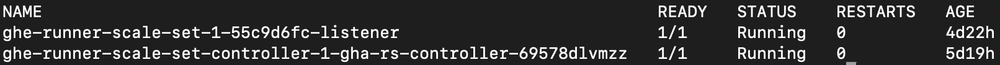
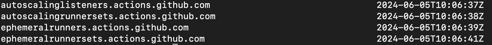
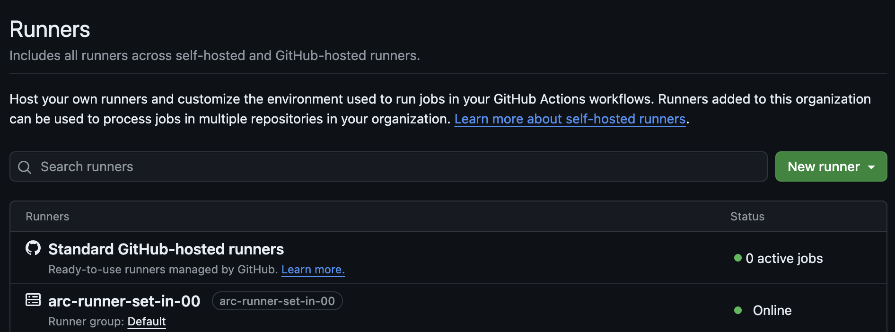

# Quickstart : Deploy GHE Runner Controller & Runner Set on GKE (Helm)

This guide streamlines the deployment of GitHub Enterprise (GHE) controllers and self-hosted runners on your Google Kubernetes Engine (GKE) cluster, leveraging Helm for efficient management.

## Overview

1. `GHE Runner Controller`: Orchestrates self-hosted runner instances for GitHub Actions.
2. `GHE Runner Set`: Dynamically scales runner instances based on your workflow demands.
3. `Helm`: Simplifies installation and configuration on Kubernetes.

## Repository Contents

This guide contains two helm chart repository details located in the `charts/` folder:

- `ghe-runner-scale-set-controller`: This chart deploys the controller responsible for managing the lifecycle and scaling of your self-hosted runner instances.
- `ghe-runner-scale-set`: This chart defines the configuration for a scalable group of runners.

## Prerequisites

Before you begin, ensure you have the following prerequisites:

- GKE Cluster: Kubernetes version 1.18 or newer.
- Tools:
    - `kubectl` configured to connect to your GKE cluster.
    - `Helm` version 3.0+
    - `gcloud` (for GKE authentication)
- GitHub:
    - GitHub Enterprise Server or GitHub Enterprise Cloud account.
    - Personal Access Token (PAT) with `repo` and `admin:org` scopes (or the minimum required).
        - Repository runners: `repo`
        - Organization runners: `admin:org`
- Docker Images: Before you can deploy your GHE configuration using Helm, you need to build your Docker images and push them to Google Artifact Registry (GAR). As this docker image value is being referred in the `values.yaml` file of helm charts.

## Deployment Instructions

1. Authenticate with GKE: Connect to your GKE cluster : 
    ```bash
    gcloud container fleet memberships get-credentials <YOUR_CLUSTER_NAME>
                                OR
    gcloud container clusters get-credentials <YOUR_CLUSTER_NAME>
    ```

2. Validation : You should see the details of your GKE cluster if connected successfully.
    ```bash
    kubectl cluster-info
    ```

3. Deploy GHE Runner Controller:
    ```bash
    # Create the namespace to deploy GHE Runner Controller
    kubectl create namespace <NAMESPACE>  # Replace with your desired namespace

    # Deploy the GHE Runner Controller 
    INSTALLATION_NAME="arc"               # Replace with your desired installation name 
    NAMESPACE="<NAMESPACE>"               # Replace with your namespace created
    helm install "${INSTALLATION_NAME}" \
    --namespace "${NAMESPACE}" \
    charts/ghe-runner-scale-set-controller
    ```

4. Validation Check :
    - Ensure pods are running
        ```bash
        kubectl get pods -n <NAMESPACE>
        ```
        

    - Ensure CRDs are installed
        ```bash
        kubectl get crds | grep actions.github.com
        ```
        

5. Deploy GHE Runner Set 
   
   Note : To deploy a runner scale set, you must have ARC up and running

   - Create a Github Personal Access Token (GITHUB_PAT)
   - Create namespace, secrets and deploy the runner set
   - Describe the GHE controller pod to get the controller service account
     ```bash
     kubectl get pods -n <NAMESPACE>
     kubectl describe pods <CONTROLLER_POD> -n <NAMESPACE>
     ```
     Copy the namespace and controller service account

    ```bash
    # Create the namespace to deploy GHE Runner Scale Set  
    kubectl create namespace <NAMESPACE>            # Replace with your desired namespace

    # Create kubernetes secret to store GitHub PAT
    kubectl create secret generic ghe-token \
    --namespace=<NAMESPACE> \
    --from-literal=github_token='<GITHUB_PAT>'      # Use your actual PAT

    # Deploy the GHE Runner Scale Set
    INSTALLATION_NAME="arc-runner-set-private"     # Replace with your desired installation name 
    NAMESPACE="<NAMESPACE>"                        # Replace with your created namespace
    GITHUB_CONFIG_URL="https://github.com/<ORGANIZATION_NAME>"
    CONTROLLER_SERVICE_ACCOUNT_NAMESPACE=""       # Replace with the controller service account
    CONTROLLER_SERVICE_ACCOUNT_NAME=""            # Replace with the controller namespace
    helm install "${INSTALLATION_NAME}" \
    --namespace "${NAMESPACE}" \
    --set githubConfigUrl="${GITHUB_CONFIG_URL}" \
    --set githubConfigSecret=ghe-token \
    --set controllerServiceAccount.namespace="${CONTROLLER_SERVICE_ACCOUNT_NAMESPACE}" \
    --set controllerServiceAccount.name="${CONTROLLER_SERVICE_ACCOUNT_NAME}" \
    charts/ghe-runner-scale-set
    ```

6. Verify the Deployment
   
   Verify by checking your GitHub organization's settings under Actions -> Runners. The deployed runner set should be listed and online.

    

## Reference Link

1. [Authenticating to GitHub API](https://docs.github.com/en/actions/hosting-your-own-runners/managing-self-hosted-runners-with-actions-runner-controller/authenticating-to-the-github-api)
2. [Quickstart for GHE Controller](https://docs.github.com/en/actions/hosting-your-own-runners/managing-self-hosted-runners-with-actions-runner-controller/quickstart-for-actions-runner-controller)
3. [Deploying runner scale sets with Actions Runner Controller](https://docs.github.com/en/actions/hosting-your-own-runners/managing-self-hosted-runners-with-actions-runner-controller/deploying-runner-scale-sets-with-actions-runner-controller)

## Troubleshooting

[Troubleshooting Actions Runner Controller errors](https://docs.github.com/en/actions/hosting-your-own-runners/managing-self-hosted-runners-with-actions-runner-controller/troubleshooting-actions-runner-controller-errors)

