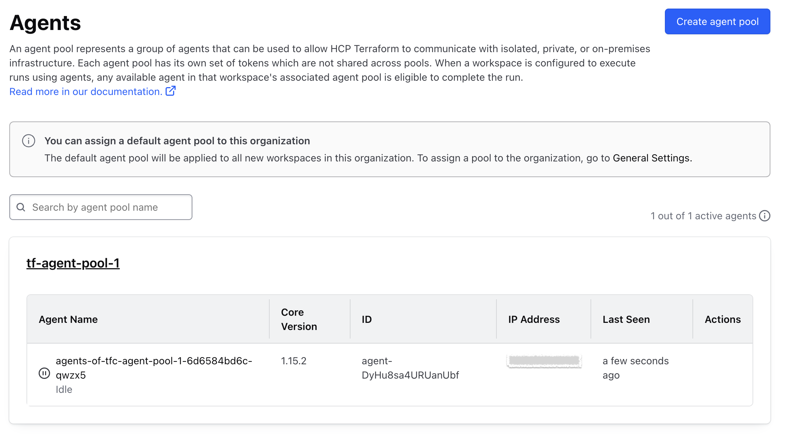

# Quickstart : Deploy Terraform Operator and Terraform Agent Pool on GKE (Helm)

This guide streamlines the deployment of the Terraform Cloud Operator and Agent Pool on your Google Kubernetes Engine (GKE) cluster using Helm.

## Overview

1. `Terraform Cloud Operator`: Kubernetes operator for managing Terraform Cloud resources directly within Kubernetes.
2. `Terraform Agent Pool`: A group of Terraform agents on Kubernetes, ready to execute your infrastructure tasks.
3. `Helm`: Simplifies installation and management of Kubernetes applications.

## Repository Contents

This guide contains two helm chart repository details located in the `charts/` folder:

- `tfc-operator`: This chart deploys the Terraform Cloud Operator, enabling you to manage Terraform Cloud resources directly within your Kubernetes cluster.
- `tfc-agent-pool`: This chart deploys a pool of Terraform agents on your Kubernetes cluster, ready to execute your Terraform infrastructure provisioning jobs.

## Prerequisites

- Kubernetes Cluster: Ensure you have a working Kubernetes cluster (version 1.18+ recommended).
- Tools:
    - `kubectl` configured to connect to your cluster.
    - `Helm` version 3.0 or later.
    - `gcloud` (for GKE authentication)
- Terraform Cloud:
    - A Terraform Cloud organization.
    - A API token which has below privileges : 
        - Manage workspaces
        - Manage projects
        - Manage VCS settings
        - Manage policies
- Docker Images: Before you can deploy your Terraform configuration using Helm, you need to build your Docker images and push them to Google Artifact Registry (GAR). As this docker image value is being referred in the `values.yaml` file of helm charts.

## Deployment Steps

1. Authenticate with GKE: Connect to your GKE cluster : 
    ```bash
    gcloud container fleet memberships get-credentials <YOUR_CLUSTER_NAME>
                                OR
    gcloud container clusters get-credentials <YOUR_CLUSTER_NAME>
    ```

2. Validation : You should see the details of your GKE cluster if connected successfully.
    ```bash
    kubectl cluster-info
    ```

3. Deploy Terraform Operator

    ```bash
    # Create Namespace 
    kubectl create namespace <NAMESPACE>

    # Deploy Operator
    INSTALLATION_NAME="tf-operator"       # Replace with your desired installation name
    NAMESPACE="<NAMESPACE>"               # Replace with your created namespace
    helm install ${INSTALLATION_NAME} \
        --namespace "${NAMESPACE}" \
        charts/tfc-operator
    ```

4. Validation Check : 
    - Ensure pods are running
        ```bash
        kubectl get pods -n <NAMESPACE>
        ```
        You should see pods for the Terraform Operator running.

        

    - Ensure CRDs are installed
        ```bash
        kubectl get crds | grep app.terraform.io
        ```
        

3. Deploy Terraform Agent Pool

    Note : To deploy a terraform agent pool, you must have terraform operator up and running.

    ```bash
    # Create Namespace 
    kubectl create namespace <NAMESPACE>

    # Create a secret containing your HCP Terraform Team API token
    kubectl create secret generic tfc-owner --from-literal=token='<TFC_API_TOKEN>' --namespace=<NAMESPACE>

    # Deploy Agent Pool
    helm install "${INSTALLATION_NAME}" charts/tfc-agent-pool \
    --namespace "${NAMESPACE}" \                       # Replace with your desired namespace
    --set organization="test-org" \                    # Replace with terraform organization name 
    --set tokenSecretName="tfc-owner" \                # Replace with your secret name
    --set tokenSecretKey="token" \
    --set agentPoolName="tf-agent-pool-01" \
    --set agentTokens[0].name="tf-agent-pool-token-01"
    ```

4. Verify the Deployment

    ```bash
    kubectl get pods -n <NAMESPACE>
    ```

    

    You should see pods for the Terraform Agent Pool running. Additionally, verify the agent status in your Terraform Cloud organization.To view agent statuses, go to your `organization's settings` and click `Agents`. 
    
    - `Idle`: The agent is running normally and waiting for jobs to be available.
 
    


## Reference Link

1. [Deploy infrastructure with the Terraform Cloud Operator](https://developer.hashicorp.com/terraform/tutorials/kubernetes/kubernetes-operator-v2)
2. [Manage agent pools with the Terraform Cloud Operator](https://developer.hashicorp.com/terraform/tutorials/kubernetes/kubernetes-operator-v2-agentpool)

